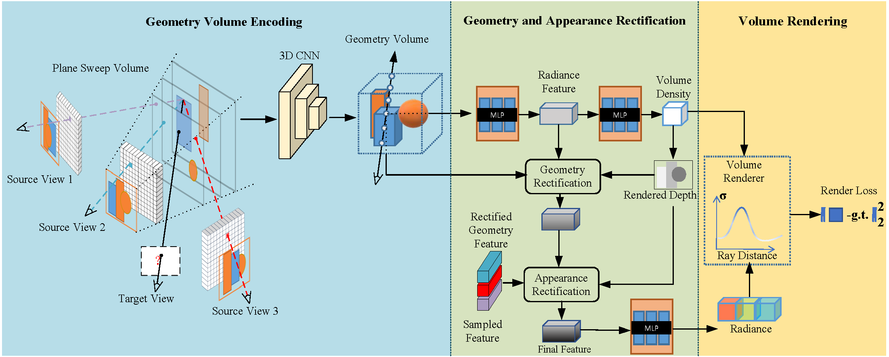
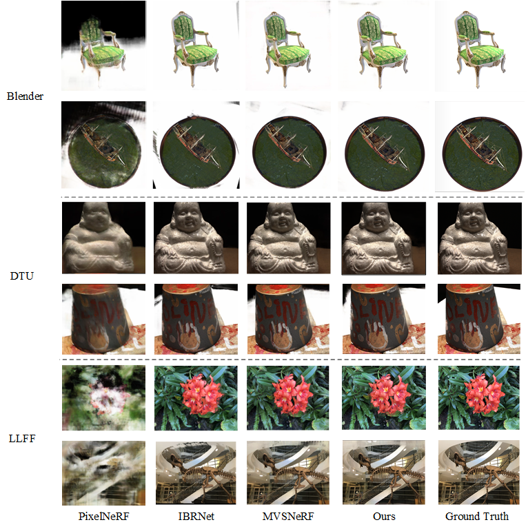
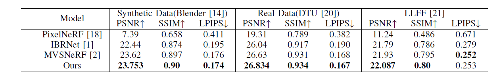
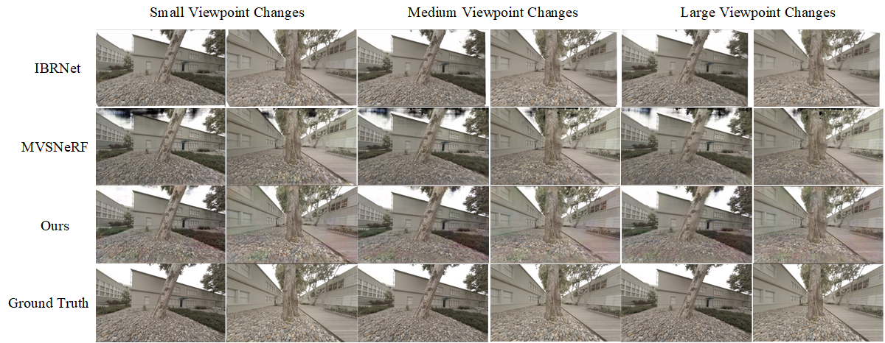
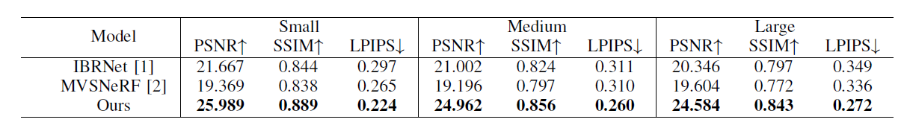
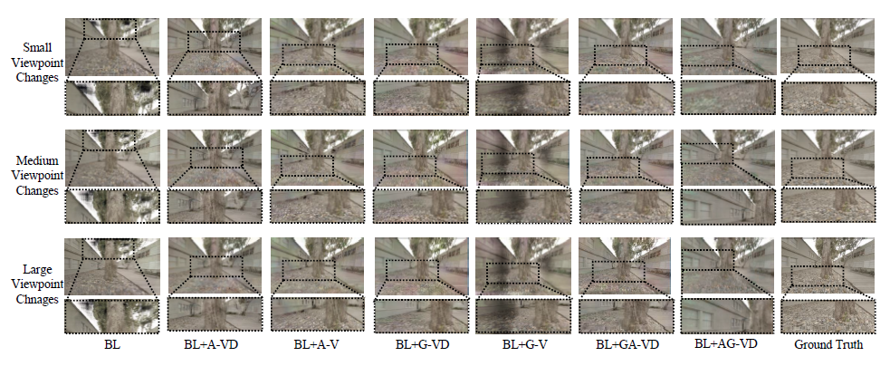
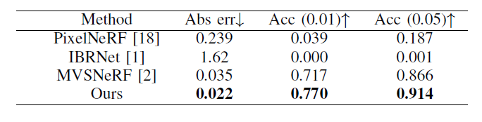

# SC-NeRF
## [Project page](https://apchenstu.github.io/mvsnerf/) |  [Paper](https://arxiv.org/abs/2103.15595)
<!-- This repository contains a pytorch lightning implementation for the ICCV 2021 paper: [SC-NeRF: Self-Correcting Neural Radiance Field with Sparse Views](https://arxiv.org/abs/2103.15595).  -->
We propose a novel end-to-end network for synthesizing realistic images from sparse input views. We firstly propose a geometry correction module based on multi-head attention. It can address the issue of black artifacts in rendered views, caused by inconsistencies in scale and structure between training and testing scenes. Building on the geometry correction module, we also design an appearance correction module to alleviate boundary blank and ghosting artifacts in rendered views caused by relatively large viewpoint changes. We validate the effectiveness of our model on four datasets, including Blender, LLFF, DTU, and Spaces. Notably, on the outdoor scenes in the Spaces dataset, our model outperforms MVSNeRF by 34.17% in terms of PSNR, and IBRNet by 19.9%.<br><br>



## Installation

#### Tested on Ubuntu 20.04 + Pytorch 1.10.1 + Pytorch Lignting 1.3.5

Install environment:
```
conda create -n scnerf python=3.8
conda activate scnerf
pip install torch==1.10.1+cu113 torchvision==0.11.2+cu113 torchaudio==0.10.1+cu113 -f https://download.pytorch.org/whl/cu113/torch_stable.html
pip install pytorch-lightning==1.3.5 imageio pillow scikit-image opencv-python configargparse lpips kornia warmup_scheduler matplotlib test-tube imageio-ffmpeg
```


## Training
Please see each subsection for training on different datasets. Available training datasets:

* [DTU](#dtu)
* [Blender](#blender) (Realistic Synthetic)
* [LLFF](#llff) (Real Forward-Facing)
* [Spaces](#spaces) 

### DTU dataset

#### Data download

Download the preprocessed [DTU training data](https://drive.google.com/file/d/1eDjh-_bxKKnEuz5h-HXS7EDJn59clx6V/view)
and [Depth_raw](https://virutalbuy-public.oss-cn-hangzhou.aliyuncs.com/share/cascade-stereo/CasMVSNet/dtu_data/dtu_train_hr/Depths_raw.zip) from original [MVSNet repo](https://github.com/YoYo000/MVSNet)
and unzip. We provide a [DTU example](https://1drv.ms/u/s!AjyDwSVHuwr8zhAAXh7x5We9czKj?e=oStQ48), please
follow with the example's folder structure.

#### Training model

Run
```
CUDA_VISIBLE_DEVICES=$cuda  python train_mvs_nerf_pl.py \
   --expname $exp_name
   --num_epochs 6
   --use_viewdirs \
   --dataset_name dtu \
   --datadir $DTU_DIR
```
More options refer to the `opt.py`, training command example:
```
CUDA_VISIBLE_DEVICES=0  python train_mvs_nerf_pl.py
    --with_depth  --imgScale_test 1.0 \
    --expname mvs-nerf-is-all-your-need \
    --num_epochs 6 --N_samples 128 --use_viewdirs --batch_size 1024 \
    --dataset_name dtu \
    --datadir path/to/dtu/data \
    --N_vis 6
```

You may need to add `--with_depth` if you want to quantity depth during training. `--N_vis` denotes the validation frequency.
`--imgScale_test` is the downsample ratio during validation, like 0.5. The training process takes about 30h on single RTX 2080Ti
for 6 epochs. 

*Important*: please always set batch_size to 1 when you are trining a genelize model, you can enlarge it when fine-tuning.

*Checkpoint*: a pre-trained checkpint is included in `ckpts/mvsnerf-v0.tar`. 

*Evaluation*: We also provide a rendering and quantity scipt  in `renderer.ipynb`, 
and we have all the test code in different `render_*.py`

Rendering from the trained model should have result like this:

## Rendering
After training or finetuning, you can render free-viewpoint videos
with the `renderer-video.ipynb`. if you want to use your own data,
please using the right hand coordinate system (intrinsic, nearfar and extrinsic either with
camera to world or world to camera in opencv format) and modify the rendering scipts.

## Results
### Qualitative analysis(The result of the weights trained in DTU datasets)

### Quantitative analysis(The result of the weights trained in DTU datasets)

Rendering quality comparison at object level and indoor data. We show the visual comparison results of our method and other NeRF-based generalization methods on 3 different test sets. For each data set, we select two sets of scenarios to show. From the red circle, it can be observed that PixelNeRF has a poorer rendering effect. From the blue circle, it can be seen that IBRNet lacks sufficient detail in handling edge details. From the green circle, it can be noticed that MVSNeRF is slightly inferior in rendering background details.
### Qualitative analysis(The result of the weights trained in DTU datasets)

### Quantitative analysis(The result of the weights trained in DTU datasets)



### Qualitative analysis(Generalization research experiment)

### Quantitative analysis(Generalization research experiment)

Rendering quality comparison at outdoor data. We show the results of a visual comparison of our method with two state-of-the-art methods on the Space dataset for three settings of different difficulty levels. From the red box, it can be observed that as the viewing angle increases, IBRNet produces blank spaces at the edges of the rendered image. From the blue box, it can be seen that MVSNeRF exhibits black pseudo-shadows in areas such as the sky. Our method can effectively solve these issues in outdoor scenes.

### Qualitative analysis(Abalation experiment)

### Quantitative analysis(Abalation experiment)

We show the visualization results of adding geometry correction module and appearance correction module on Baseline. We mark the area of our concern with a box to highlight problems such as rendering holes and artifact transfer.
